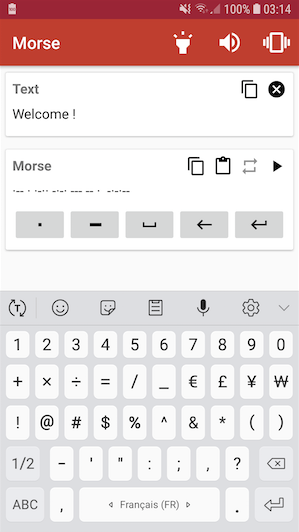

# MorseApp

This application allow the user to write a text, and translate it in morse code.
The morse code is written with dots and dashes, and can be played with the flash light, vibrations and sound.



# Set up :
To open this project in android studio you need to to set up secure files.
- Add google-services.json in './app'
- Add in your '~/.gradle/gradle.properties' key store properties :
```
RELEASE_STORE_FILE=XXX
RELEASE_STORE_PASSWORD=XXX
RELEASE_KEY_PASSWORD=XXX
RELEASE_KEY_ALIAS=XXX
```

# Libraries used :
- **Exoplayer** - to manage the sound control
- **Crashlytics from Firebase** - bug reporting
- **AndroidX**

# Release
- 1.0.4 - 2024/04/02 - update target version to 34

- 1.0.3 - 2022/07/13 - update target version to 32

- 1.0.2 - 2020/09/29 - update libraries

- 1.0.1 - 2020/09/08 - update target API to Android 10

- 1.0.0 - 2020/04/14 - First release

